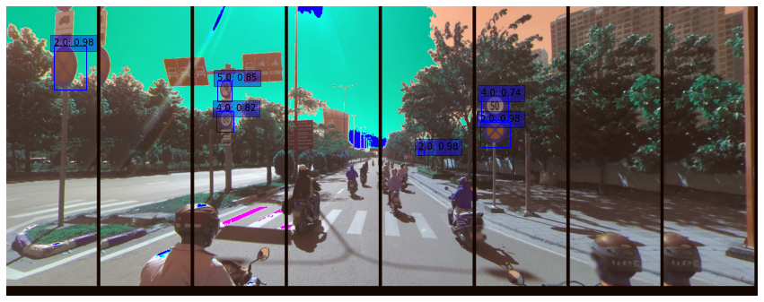
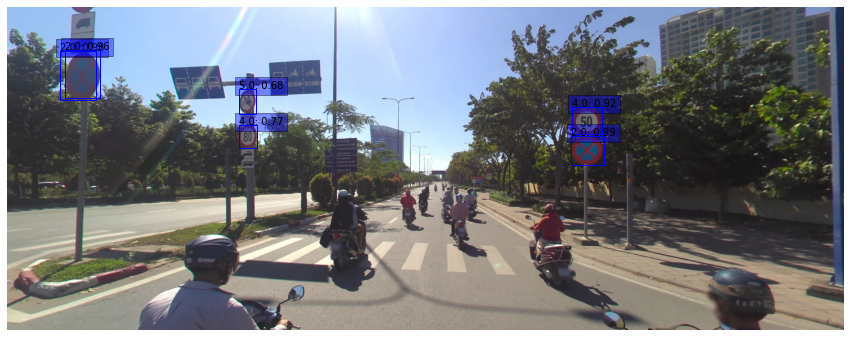
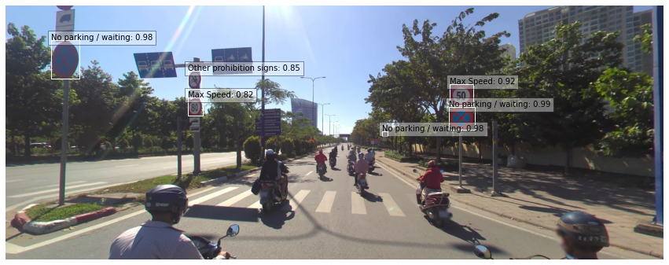
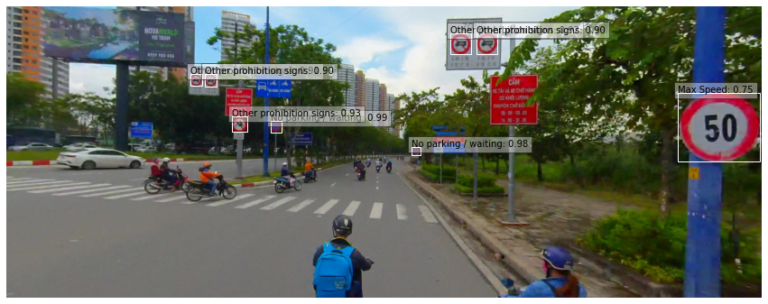
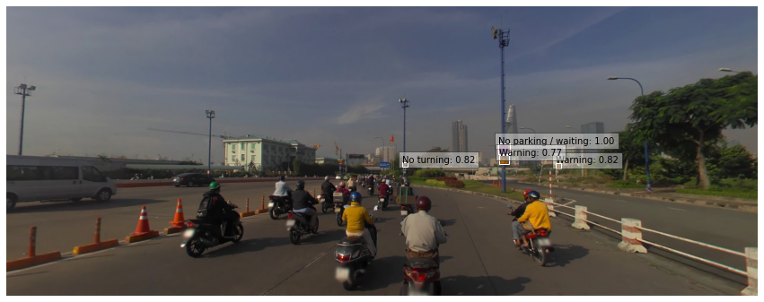
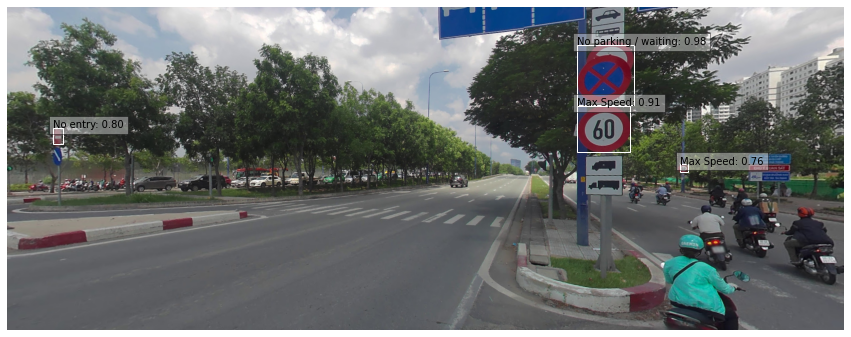

# traffic sign detection <a href="https://colab.research.google.com/github/ptran1203/traffic_sign_detection/blob/main/traffic_signs_detection.ipynb" target="_parent"></a>

Solution for Zalo AI traffic signs detection.

[Original implementation](https://keras.io/examples/vision/retinanet/) of RetinaNet by Srihari Humbarwadi

<!-- Original dataset of competition:
+ Train: https://dl.challenge.zalo.ai/traffic-sign-detection/data/za_traffic_2020.zip
+ Test: https://dl.challenge.zalo.ai/traffic-sign-detection/data/traffic_private.zip -->

## Dataset

https://www.kaggle.com/phhasian0710/za-traffic-2020/download

## Method
After taking a quick look at the dataset, we can see that there are many small signs. Which makes the model hard to detect them. One of the possible methods in this scenario is [Image Tiling](https://openaccess.thecvf.com/content_CVPRW_2019/papers/UAVision/Unel_The_Power_of_Tiling_for_Small_Object_Detection_CVPRW_2019_paper.pdf)

In detail, I will crop the image into a few parts with some overlaps, predict each part and the original image. Then combine the result using non-max suppression.

### 1. Image cropping


### 2. Predict on each part (the color looks strange because the images are pre-processed)


### 3. Predict on the whole image


### 3. Combine the results


## Data augmentation

Data augmentation used for trainning includes:

1. Random brightness adjustment (p=50%)
2. Random contrast adjustment (p=50%)
3. Auto crop a region contains at least 1 bouding box (p=50%)
4. Random horizontal flipping (p=50%)
5. Random gaussian blur or motion blur (p=50%)


## Trainning

```bash
python3 train.py --input {image_dir}\
                  --backbone resnet50\
                  --batch-size 4\
                  --checkpoint-dir /content/weights
```

## Inference

```bash
python3 prediction.py --input {image_dir}\
                      --output submission.json\
                      --weight weights/weight_resnet50.h5\   # weight file should has format weight_{backbone}.h5
                      --save-dir /content/inference_images   # or "" if you dont want to save images
                      --scales 896,1024                      # Separated by comma
                      --tiling                               # Apply tiling if provided, useful for small objects
```

## Inference result





---
**NOTE**

This project is running on Google Colaboratory environment, so it may contain some issues when running on local machine, please don't hesitate to create a new issue

---
