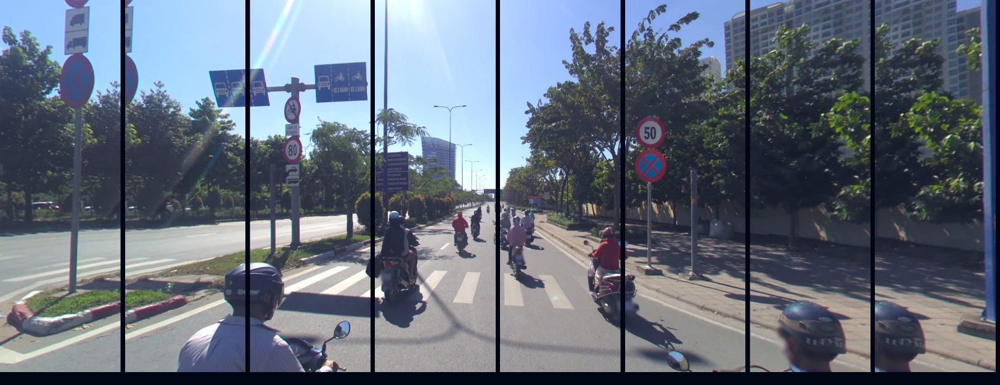

# traffic_sign_detection

Solution for Zalo AI traffic signs detection.

Start with [Colab](https://github.com/ptran1203/traffic_sign_detection/blob/main/traffic_signs_detection.ipynb)

[Original implementation](https://keras.io/examples/vision/retinanet/) of RetinaNet by Srihari Humbarwadi

Original dataset of competition:
+ Train: https://dl.challenge.zalo.ai/traffic-sign-detection/data/za_traffic_2020.zip
+ Test: https://dl.challenge.zalo.ai/traffic-sign-detection/data/traffic_private.zip

## Method
After taking a quick look at the dataset, we can see that there are many small signs. Which makes the model hard to detect them. One of the possible methods in this scenario is [Image Tiling](https://openaccess.thecvf.com/content_CVPRW_2019/papers/UAVision/Unel_The_Power_of_Tiling_for_Small_Object_Detection_CVPRW_2019_paper.pdf)

In detail, I will crop the image into a few parts with some overlaps, predict each part and the original image. Then combine the result using non-max suppression.

### 1. Image cropping


### 2. Predict on each part


### 3. Predict on the whole image


### 3. Combine the results


## Data augmentation

Data augmentation used for trainning includes:

1. Random brightness adjustment (p=50%)
2. Random contrast adjustment (p=50%)
3. Auto crop a region contains at least 1 bouding box (p=50%)
4. Random horizontal flipping (p=50%)
5. Random gaussian blur or motion blur (p=50%)


## Trainning

```bash
python3 train.py --input [path to training images]
```

## Inference

```bash
./predict.sh
or
python3 prediction.py --input [path to test images] --output [path to submission file]
```

## Inference result


---
**NOTE**

This project is running on Google Colaboratory environment, so it may contain some issues when running on local machine, please don't hesitate to create a new issue

---
